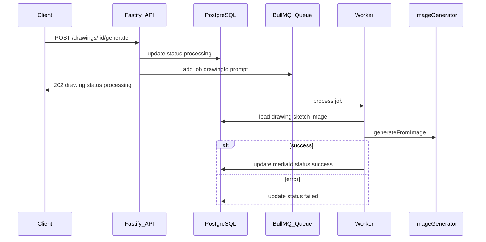

# Research: Geração assíncrona de imagem (BullMQ + Redis) e status em `drawings`

## Questions

- Como funciona hoje `generateImageForDrawing` e quem chama?
- Onde está o modelo de dados de `drawings` e como propagar `status`?
- Quais pontos de integração (Fastify, Drizzle, gerador de imagem) precisam ser separados entre API e worker?
- Como mapear estados do job BullMQ para `processing`, `success` ou `failed` na tabela?
- O que é necessário em infra (Redis, processo worker, variáveis de ambiente)?

## Findings

### Implementação atual

- **`DrawingService.generateImageForDrawing`** ([`src/modules/drawing/drawing-service.ts`](../src/modules/drawing/drawing-service.ts)) executa de forma síncrona na requisição: carrega drawing → sketch → imagem base pela URL → `ImageGenerator.generateFromImage` → `ImageService.createFromUpload` → `repo.update` com o novo `mediaId`.
- **`POST /drawings/:id/generate`** ([`src/modules/drawing/drawing-controller.ts`](../src/modules/drawing/drawing-controller.ts)) devolvia HTTP 200 com o drawing já contendo o `mediaId` gerado.
- O modelo **`Drawing`** não tinha campo de status; a tabela Drizzle **`drawings`** ([`src/infrastructure/db/drizzle/schema.ts`](../src/infrastructure/db/drizzle/schema.ts)) só tinha `media_id`, `sketch_id`, `title`, `description`.
- O projeto usa **Fastify + Drizzle + PostgreSQL**; não havia **Redis** nem **BullMQ** nas dependências. O bootstrap em [`src/app.ts`](../src/app.ts) sobe apenas o servidor HTTP.

### Desenho adotado

- Foi adicionada a coluna **`status`** em `drawings` com valores `processing`, `success` e `failed` (enum PostgreSQL via Drizzle). O default é **`null`** (sem geração concluída ainda); após migração, valores antigos `done` foram convertidos para **`success`**.
- O endpoint **`POST /drawings/:id/generate`** valida pré-condições, define `status = processing`, enfileira um job BullMQ com `{ drawingId, prompt? }` e responde **HTTP 202** com o drawing atualizado.
- Um processo **`worker`** separado consome a fila, reutiliza a mesma lógica de geração (factory `createImageGenerator`) e ao sucesso atualiza `mediaId` e `status = success`; em falha definitiva atualiza `status = failed`.
- Conexão Redis via **`ioredis`** e variáveis de ambiente (`REDIS_URL` ou `REDIS_HOST` / `REDIS_PORT` / `REDIS_PASSWORD`).
- **`jobId`** estável por drawing (`drawing-image-gen-{id}`) reduz duplicidade; requisições enquanto `processing` retornam **409 Conflict**.

## Recommendations

- Manter **dois processos** em produção: API (produtor) e **worker** (consumidor); subir **Redis** antes de ambos.
- Expor **`status`** em `GET /drawings` e `GET /drawings/:id` para o cliente fazer polling ou futuramente WebSocket/SSE.
- Documentar variáveis de ambiente no README ou `.env.example` quando existir.
- Evoluir com: métricas da fila, DLQ, ou campo opcional `lastError` se o produto precisar de diagnóstico na API.

## Files Examined

- [`docs/research/template.md`](template.md) — estrutura do documento de research.
- [`src/modules/drawing/drawing-service.ts`](../src/modules/drawing/drawing-service.ts) — geração e orquestração do drawing.
- [`src/modules/drawing/drawing-controller.ts`](../src/modules/drawing/drawing-controller.ts) — rotas HTTP e schemas Zod.
- [`src/modules/drawing/drawing.ts`](../src/modules/drawing/drawing.ts) — interface do domínio.
- [`src/modules/drawing/repository/drizzle-drawing-repository.ts`](../src/modules/drawing/repository/drizzle-drawing-repository.ts) — persistência.
- [`src/infrastructure/db/drizzle/schema.ts`](../src/infrastructure/db/drizzle/schema.ts) — schema e migrações.
- [`src/infrastructure/queue/redis-connection.ts`](../src/infrastructure/queue/redis-connection.ts) — cliente Redis (ioredis) para BullMQ.
- [`src/infrastructure/queue/drawing-image-generation-queue.ts`](../src/infrastructure/queue/drawing-image-generation-queue.ts) — fila e enfileiramento.
- [`src/infrastructure/queue/drawing-image-generation-worker.ts`](../src/infrastructure/queue/drawing-image-generation-worker.ts) — worker e marcação `failed` terminal.
- [`src/worker.ts`](../src/worker.ts) — entrypoint do processo worker.
- [`src/app.ts`](../src/app.ts) — bootstrap da API.
- [`package.json`](../package.json) — dependências e scripts.
- [`src/infrastructure/ai/image-generator-factory.ts`](../src/infrastructure/ai/image-generator-factory.ts) — provedor de geração de imagem.
