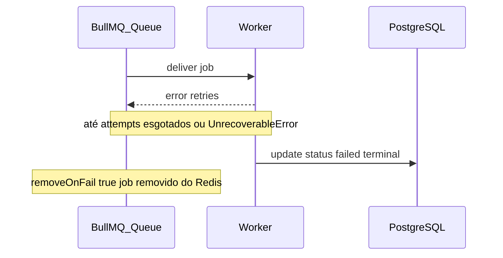
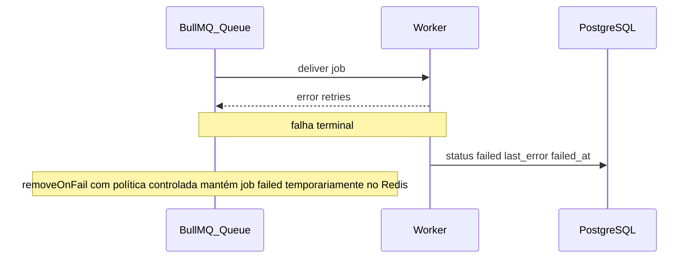

# Research: Dead Letter Queue para jobs de geração de imagem (BullMQ)

## Questions

- O que acontece hoje com jobs de geração de imagem após esgotar tentativas ou após `UnrecoverableError`?
- Que mecanismo nativo do BullMQ 5 suporta retenção e reprocessamento de jobs falhos, e como encaixa com persistência no domínio?
- Como alinhar reprocessamento no broker (Redis) com auditoria e diagnóstico no domínio (PostgreSQL) numa **única** linha de desenho?
- Quais encaixes mínimos com o fluxo assíncrono já descrito em [async-drawing-image-generation-bullmq.md](async-drawing-image-generation-bullmq.md) (API `processing`, worker, `status` em `drawings`)?

## Findings

### Implementação atual

- A fila **drawing-image-generation** ([`src/infrastructure/queue/drawing-image-generation-queue.ts`](../src/infrastructure/queue/drawing-image-generation-queue.ts)) usa `defaultJobOptions` com `attempts: 3`, `backoff` exponencial (5s), `removeOnComplete: true` e **`removeOnFail: true`**. Com `removeOnFail: true`, o BullMQ **remove o job após a falha final**; não permanecem registros de jobs falhos no broker para inspeção ou retry idempotente a partir do Redis. Completar com sucesso também remove o job do conjunto concluído, coerente com `removeOnComplete: true`.
- O **worker** ([`src/infrastructure/queue/drawing-image-generation-worker.ts`](../src/infrastructure/queue/drawing-image-generation-worker.ts)) trata o evento `failed`: se a falha for terminal (`UnrecoverableError` **ou** `job.attemptsMade >=` tentativas máximas do job), o repositório atualiza o drawing com **`status: "failed"`** no PostgreSQL. A regra de negócio de “falha definitiva” fica portanto refletida no **banco relacional**, não no Redis.
- O entrypoint [`src/worker.ts`](../src/worker.ts) instancia o worker, regista `completed`/`failed` com logs e trata `SIGINT`/`SIGTERM` com `close()` gracioso; não movimenta jobs para nenhuma fila secundária.
- O fluxo geral (API enfileira, `processing` no DB, worker consome, `success` ou `failed`) permanece o descrito no research [async-drawing-image-generation-bullmq.md](async-drawing-image-generation-bullmq.md). O que **falta** em termos de DLQ é, sobretudo, **retenção reutilizável do payload/estado do job no broker** (ou um equivalente em DB) após a falha terminal.

Com a abordagem combinada (retenção no broker + `last_error` no DB), o alvo qualitativo é manter o job em `failed` no Redis **e** persistir o erro no desenho:

### Abordagem recomendada: broker e domínio (BullMQ + PostgreSQL)

Este research fixa **uma** estratégia, combinando intencionalmente dois eixos que se complementam (e antes apareciam como alternativas separadas):

- **BullMQ — retenção de jobs falhos** (equivalente à ideia de “não apagar o job no Redis ao falhar de forma final”): ajustar `removeOnFail` em [`drawing-image-generation-queue.ts`](../src/infrastructure/queue/drawing-image-generation-queue.ts) para um objeto com limite de contagem/idade, evitando false para não reter jobs indefinidamente conforme a [API do BullMQ 5](https://docs.bullmq.io), de modo a que o job fique acessível no estado `failed` para `retry`/`getJobs` / ferramentas como [Bull Board](https://github.com/felixmosh/bull-board). Assim a **operational recovery** (reprocessar o mesmo `jobId` e payload) continua a residir no **broker** onde o trabalho foi agendado.

- **PostgreSQL — prova e diagnóstico de domínio** (alinhado a `lastError` já sugerido no [research assíncrono](async-drawing-image-generation-bullmq.md)): na transição para falha **terminal** (hoje: `UnrecoverableError` ou `attemptsMade` máximo), além de `status: "failed"`, persistir **`last_error`** (mensagem e, se fizer sentido, um resumo de stack) e opcionalmente **`failed_at`**. Isto dá **fonte de verdade** para a API e suporte sem depender da retenção no Redis, e desacopla a vida útil do registo de drawing da política de memória do Redis.

**Papel de cada camada:** o Redis responde “existe ainda o job e posso dar retry operacional?”. O PostgreSQL responde “qual foi o último motivo conhecido para este drawing, visível no produto?”. A combinação evita a armadilha de só o Redis (sem rasto no modelo de `drawings` para a UI) e só o PG (sem job endereçável no BullMQ para re-enfileirar a partir do mesmo registo, salvo re-enqueue completo à mão).

**Cuidados comuns a ambos os lados:** definir **política de retenção** dos jobs `failed` no Redis (evita crescimento ilimitado); e limitar tamanho/PII de `last_error` se necessário. Ferramentas de observabilidade (Sentry, logs) podem continuar a existir, mas **não substituem** este par broker + domínio.

## Recommendations

- Implementar a abordagem **única** descrita: **retenção controlada de jobs `failed` no BullMQ** (substituir `removeOnFail: true` por política alinhada à documentação do BullMQ 5) e **gravação de `last_error` (e `failed_at` se útil) no mesmo momento em que `status` vira `failed`**, de forma a que a API e o suporte leiam o domínio enquanto operações dão `retry` no broker.
- Documentar no produto/ops: limite de memória/TTL para jobs `failed` no Redis; truncamento de mensagens longas de erro no PostgreSQL, se necessário; opcionalmente Bull Board (ou similar) apontado à fila de geração.
- Manter o research [async-drawing-image-generation-bullmq.md](async-drawing-image-generation-bullmq.md) como contexto: ele já apontava **DLQ** e **`lastError`**: esta nota concretiza isso num par **BullMQ + `drawings`**, em vez de filas de dead letter paralelas.

## Files Examined

- [`docs/research/template.md`](template.md) — estrutura padrão do research.
- [`docs/research/async-drawing-image-generation-bullmq.md`](async-drawing-image-generation-bullmq.md) — fluxo assíncrono, estados e recomendação de DLQ/`lastError`.
- [`src/infrastructure/queue/drawing-image-generation-queue.ts`](../src/infrastructure/queue/drawing-image-generation-queue.ts) — `defaultJobOptions`, `removeOnFail`, enfileiramento.
- [`src/infrastructure/queue/drawing-image-generation-worker.ts`](../src/infrastructure/queue/drawing-image-generation-worker.ts) — evento `failed` e atualização `status: failed`.
- [`src/infrastructure/queue/redis-connection.ts`](../src/infrastructure/queue/redis-connection.ts) — conexão ioredis para BullMQ.
- [`src/worker.ts`](../src/worker.ts) — bootstrap do processo worker.
- [`package.json`](../package.json) — confirmação de **bullmq** `^5.73.5` (comportamento de opções alinhado à série 5.x).

## Ops: limites Redis, truncamento e ferramentas

- **BullMQ — jobs `failed` no Redis:** a fila [`drawing-image-generation-queue.ts`](../src/infrastructure/queue/drawing-image-generation-queue.ts) usa `removeOnFail: { count, age }` (valores padrão: 100 jobs, 7 dias de idade em segundos). Override sem alterar código: `BULLMQ_FAILED_JOBS_MAX_COUNT`, `BULLMQ_FAILED_JOBS_MAX_AGE_SECONDS`. Completar ainda com sucesso continua a usar `removeOnComplete: true` (concluídos removidos). Isto equilibra inspeção/retry operacional (ex. [Bull Board](https://github.com/felixmosh/bull-board) na fila `drawing-image-generation`) com teto de memória no Redis.
- **PostgreSQL — diagnóstico:** colunas `last_error` (text) e `failed_at` (timestamptz) em `drawings`; a mensagem é truncada a ~2000 caracteres no worker; não se inclui o prompt do utilizador, apenas o resumo de `Error`/`stack`.
- **Falha terminal** continua a ser `UnrecoverableError` ou tentativas esgotadas; a API expõe `lastError` e `failedAt` (ISO 8601) em listagem e detalhe.
