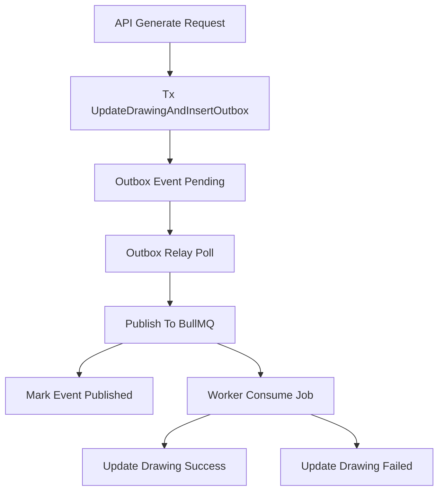

# Research: Outbox Pattern for Drawing Image Generation

## Questions

- Como garantir consistencia entre a mudanca de status do drawing e a publicacao do job na fila?
- Quais falhas parciais existem no fluxo atual `update DB -> enqueue queue`?
- Qual desenho de outbox melhor se encaixa no stack atual (Fastify + Drizzle + BullMQ + Redis)?
- Como garantir idempotencia ponta a ponta (API, relay e worker)?
- Quais sinais de observabilidade e operacao sao necessarios para suportar incidentes?

## Findings

### Fluxo atual de geracao

- O endpoint `POST /drawings/:id/generate` chama `DrawingService.enqueueGenerateImageForDrawing(...)` e retorna `202`.
- Em `DrawingService.enqueueGenerateImageForDrawing`, o fluxo valida o drawing, faz `status = processing` no banco, e so depois chama `enqueueDrawingImageGeneration(...)`.
- O worker BullMQ chama `DrawingService.processImageGenerationJob(...)`, gera a imagem e atualiza `status` para `success` (ou `failed` em falha terminal no handler de falhas do worker).

### Lacunas de consistencia

- Nao existe atomicidade entre gravacao de estado no banco e publicacao no broker.
- Se o processo cair apos `status=processing` e antes do enqueue, o drawing pode ficar preso em estado inconsistente.
- A estrategia atual de rollback em caso de erro no enqueue reduz risco, mas nao cobre quedas de processo e tambem nao elimina corridas concorrentes.
- `jobId` estavel reduz duplicacao de jobs, mas nao resolve entrega confiavel da mensagem quando o broker esta indisponivel.

### Integracao com stack atual

- O projeto ja possui BullMQ, Redis, worker separado e status de processamento no agregado `drawing`.
- O ponto de entrada ideal para outbox e o caso de uso de enfileiramento no service (`enqueueGenerateImageForDrawing`), por ser o limite transacional entre dominio/aplicacao e infraestrutura assincrona.

## Recommendations

- Adotar **Transactional Outbox** para separar com seguranca:
  - transacao de estado do dominio (`drawings.status = processing`);
  - publicacao assincrona no broker (BullMQ) feita por relay.
- Tratar a tabela de outbox como **fonte de verdade para mensagens pendentes**.
- Implementar relay com polling curto e lock otimista/pessimista para publicar eventos pendentes em lotes com retry.
- Manter idempotencia no consumo com chave estavel (`drawingId` no `jobId`) e, opcionalmente, `eventId` para rastreio fim a fim.
- Definir SLO operacional com base em idade maxima de evento pendente e taxa de falha de publicacao.

### Arquitetura proposta

### Modelo de dados sugerido (alto nivel)

- `outbox_events`
  - `id` (uuid)
  - `aggregate_type` (ex.: `drawing`)
  - `aggregate_id` (ex.: drawing id)
  - `event_type` (ex.: `DrawingImageGenerationRequested`)
  - `payload` (jsonb com `drawingId`, `prompt`)
  - `status` (`pending`, `publishing`, `published`, `failed`)
  - `attempts` (int)
  - `next_attempt_at` (timestamp)
  - `last_error` (text nullable)
  - `created_at` (timestamp)
  - `published_at` (timestamp nullable)

### Fluxo transacional recomendado

1. API recebe requisicao de geracao.
2. No mesmo commit de banco:
   - atualiza drawing para `processing` (limpando `lastError` e `failedAt`);
   - insere evento `DrawingImageGenerationRequested` em `outbox_events` com `pending`.
3. Relay le eventos `pending` aptos para envio e publica no BullMQ.
4. Em sucesso de publish, relay marca `published` e grava `published_at`.
5. Worker processa job e atualiza drawing para `success` ou `failed`.

### Falhas e recuperacao

- **Redis indisponivel**: evento permanece `pending/failed` e sera reenviado no proximo ciclo.
- **Crash apos commit e antes de publish**: relay garante envio posterior sem perda de comando.
- **Falha durante publish**: incrementar `attempts`, registrar `last_error`, reagendar com backoff.
- **Evento poison**: apos limite de tentativas, manter `failed` para intervencao operacional.
- **Duplicidade de entrega**: manter consumo idempotente no worker (estado atual + `jobId` estavel).

### Observabilidade minima

- Metricas:
  - total de eventos `pending`
  - idade do evento pendente mais antigo
  - taxa de publish com sucesso/erro
  - tentativas por evento
- Logs estruturados com `event_id`, `drawing_id`, `job_id`.
- Alertas quando backlog cresce acima de limite ou idade pendente ultrapassa SLO.

### Estrategia de migracao

1. Criar tabela de outbox e indice por `status + next_attempt_at`.
2. Alterar fluxo da API para gravar outbox em transacao com update do drawing.
3. Introduzir relay em processo separado (ou no worker) com rollout gradual.
4. Habilitar monitoracao e alertas.
5. Remover caminho legado de enqueue direto no service.

### Criterios de aceite da arquitetura

- Nao existir drawing em `processing` sem evento correspondente em outbox durante janela de publicacao.
- Interrupcoes temporarias no Redis nao causarem perda permanente de requisicoes de geracao.
- Reprocessamento de relay/worker nao gerar efeitos duplicados observaveis no estado final do drawing.
- Backlog de outbox ser monitoravel e acionavel operacionalmente.

## Files Examined

- [`docs/research/template.md`](template.md) - template oficial para estrutura do research.
- [`docs/research/async-drawing-image-generation-bullmq.md`](async-drawing-image-generation-bullmq.md) - contexto da arquitetura assincrona atual.
- [`src/modules/drawing/drawing-service.ts`](../src/modules/drawing/drawing-service.ts) - orquestracao atual de status e enqueue.
- [`src/modules/drawing/drawing-controller.ts`](../src/modules/drawing/drawing-controller.ts) - entrada HTTP para geracao.
- [`src/infrastructure/queue/drawing-image-generation-queue.ts`](../src/infrastructure/queue/drawing-image-generation-queue.ts) - contrato de enfileiramento BullMQ.
